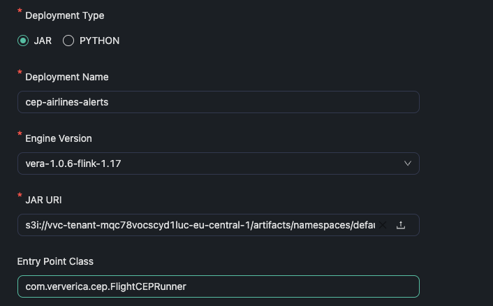

Complex Event Processing (CEP) Demo
-----------------------------------
This is a demo application, to illustrate **Complex Event Processing (CEP) with Apache Flink on Ververica.**


You can also check [this blog post](https://www.ververica.com/blog/real-time-insights-for-airlines-with-complex-event-processing).

<p align="center">
    
</p>


### Background
Airline operations are complex and time-sensitive. Monitoring and detecting critical events, such as delays or security threats, are essential to maintaining efficient operations and ensuring passenger safety. 

The goal is to create a **real-time streaming application using Apache Flink** that:

- ✅ Detects flight delays correlated with adverse weather conditions.
- ✅ Monitors and escalates security incidents (e.g., unattended luggage).
- ✅ Analyzes aircraft turnaround times to optimize ground operations.

With Apache Flink’s CEP library, we define the following patterns:

### Weather-Related Flight Delays
This pattern detects delays associated with severe weather. We define it to look for a sequence where a `DELAY` event is followed by a `WEATHER` event within a short time frame.
```java
Pattern<FlightEvent, ?> weatherPattern = Pattern.<FlightEvent>begin("weatherAlert")
                .where(new IterativeCondition<FlightEvent>() {
                    @Override
                    public boolean filter(FlightEvent event, Context<FlightEvent> ctx) throws Exception {
                        return event.getEventType().equals("WEATHER") && event.getDetails().contains("storm");
                    }
                });
```

### Security Incident Escalation
This pattern monitors security alerts that escalate, such as a sequence where an initial `SECURITY` event is followed by further details indicating a heightened threat (e.g., suspicious activities or threat investigations).
```java
Pattern.<FlightEvent>begin("securityAlert")
                .where(new IterativeCondition<FlightEvent>() {
                    @Override
                    public boolean filter(FlightEvent event, Context<FlightEvent> ctx) throws Exception {
                        return event.getEventType().equals("SECURITY");
                    }
                });
```

### Turnaround Efficiency
This pattern tracks if an aircraft departs within a 45-minute window after landing. This helps evaluate how efficiently the airline handles aircraft turnaround.
```java
Pattern<FlightEvent, ?> turnaroundPattern = Pattern.<FlightEvent>begin("arrival")
                .where(new IterativeCondition<FlightEvent>() {
                    @Override
                    public boolean filter(FlightEvent event, Context<FlightEvent> ctx) throws Exception {
                        return event.getEventType().equals("LANDING");
                    }
                })
                .next("departure")
                .where(new IterativeCondition<FlightEvent>() {
                    @Override
                    public boolean filter(FlightEvent event, Context<FlightEvent> ctx) throws Exception {
                        FlightEvent arrivalEvent = ctx.getEventsForPattern("arrival").iterator().next();
                        return event.getEventType().equals("TAKEOFF") &&
                                event.getFlightId().equals(arrivalEvent.getFlightId()) &&
                                event.getAirportCode().equals(arrivalEvent.getAirportCode()) &&
                                (event.getTimestamp() - arrivalEvent.getTimestamp()) <= 45 * 60 * 1000; // 45 minutes
                    }
                });
```

When these patterns are detected, Flink generates alerts using the **PatternSelectFunction**
```java
securityPatternStream.select((PatternSelectFunction<FlightEvent, String>) pattern -> {
    FlightEvent securityEvent = pattern.get("securityAlert").get(0);
                return "Security Alert: Incident detected at " + securityEvent.getAirportCode() + " for Flight " + securityEvent.getFlightId() +
            " - " + securityEvent.getDetails();
}).name("SecurityPattern").uid("SecurityPattern");
```
### Deployment
Run `mvn clean package` to create a jar file


On the `Artifacts` tab upload the generated jar file
<p align="center">
    
</p>

Then navigate to the `Deployments` tab, click `new deployment` and put the required fields.
<p align="center">
    
</p>

Finally click `start` and after a while you will see your job running.
<p align="center">
    
</p>

### Sample Output

```shell
Turnaround Efficiency Achieved: Flight EK201 landed at DXB and took off within 45 minutes.
Security Alert: Incident detected at LAX for Flight EK201 - Suspicious activity
Weather Alert: Severe weather condition at DXB - Heavy storm warning
Security Alert: Incident detected at LAX for Flight EK201 - Bomb threat investigation
Security Alert: Incident detected at DXB for Flight EK205 - Suspicious activity
Weather Alert: Severe weather condition at LHR - Heavy storm warning
```
